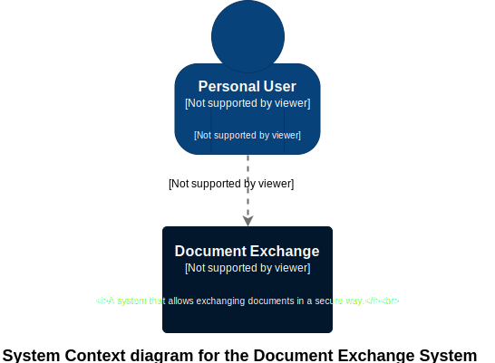
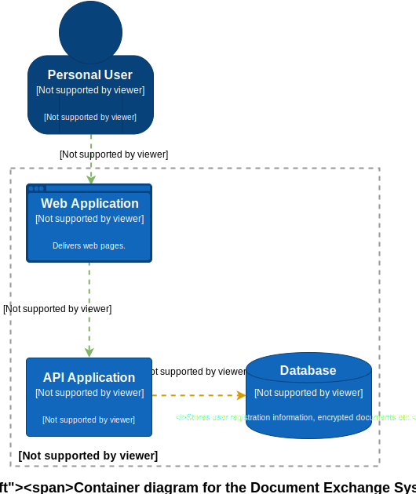

# Architecture

Architecture for this system is developed using [C4 model](https://c4model.com/)  at [draw.io](https://draw.io/) with [C4-Model-Lib.xml](C4-Model-Lib.xml) library.

## Level 1 - System Context

## Level 2 -  Containers

## Level 3 - Components
### Web Application Component
### Database Component
### API Application Component

## Level 4 - Code
There will be no Code diagram because codebase is changing in rapid pease and it is useless to maintain it with every change.