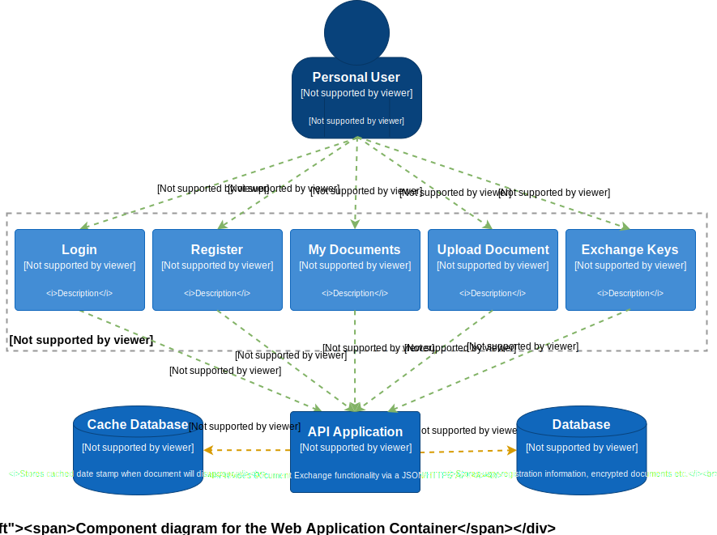

# Wstęp

## Cel

Celem niniejszego dokumentu jest przedstawienie wymagań nakładanych na system przeznaczonego do dzielenia się plikami zabezpieczonymi kluczem symetrycznym. W opracowaniu oparto się na normach,zaleceniach lub ich szkicach w momencie tworzenia tego dokumentu.

# Wprowadzenie
Przedstawiony poniżej profil zabezpieczeń definiuje wymagania bezpieczeństwa dla systemu dzielenia się zabezpieczonymi plikami pomiędzy użytkownikami systemu. Przez "system do dzielenia się zabezpieczonymi plikami" rozumie się system realizujący szyfrowanie/deszyfrowanie pliku z wykorzystaniem do tego celu klucza symetrycznego wygenerowanego przez nadawcę, natomiast proces przekazania klucza jednemu bądź wielu odbiorcom odbywa się z wykorzystaniem protokołu Diffiego-Hellmana. Właściciel współdzielonego pliku w niniejszym systemie może predefiniować jego czas życia — po jego upływie zostaje on usunięty.

## Identyfikacja
<b>Tytuł:</b>
Profil zabezpieczeń - system do dzielenia się zabezpieczonymi plikami 
<b>Autorzy:</b>
Krzysztof Kołodziejczak, Patryk Piotrowski, Patryk Prokurat, Jakub Dyba,
Artur Ziemba, Bartosz Gawdzis, Albert Liberski, Mateusz Gnyp 
<b>Status głosowania:</b> CC Version: 1.0 (Grudzień 2018) 
<b>Ogólny status:</b> Draft 
<b>Numer wersji:</b> 1.0
<b>Słowa kluczowe:</b> szyfrowanie/deszyfrowanie danych, współdzielenie danych, klucz symetryczny, klucz asymetryczny, protokół Diffiego-Hellmana. 

# Opis przedmiotu oceny

Ta część profilu zabezpieczeń zawiera opis przedmiotu oceny (TOE), rodzaj produktu, który prezentuje, jak również opis ogólnej funkcjonalności TOE. Przedstawiona funkcjonalność, podlegająca ocenie, dotyczy szyfrowania/deszyfrowania danych z wykorzystaniem klucza symetrycznego, przekazania klucza za pomocą protokołu Diffiego-Hellmana i ustanawiania bezpiecznego połączenia klienta z serwerem z wykorzystaniem połączenia HTTPS.

## Opis TOE

Przedmiotem oceny, rozważanym w niniejszym dokumencie, jest pięć komponentów: "Login, Register, My Documents, Upload Document, Exchange Keys", wchodzące w skład Document Exchange System — system dzielenia się zaszyfrowanymi plikami pomiędzy użytkownikami.

### Login - komponent odpowiada za:

- logowanie użytkownika do systemu po poprawnym jego uwierzytelnieniu;
- logowanie z wykorzystaniem protokołu HTTPS.

### Register

- rejestrację użytkownika do systemu (użytkownik podaje login, hasło, powtórzone hasło i adres e-mail);
- weryfikuje poprawność wprowadzonych danych;
- tworzy nowe konto użytkownika po uprzednim spełnieniu wymagań dotyczących rejestracji;
- rejestracja z wykorzystaniem protokołu HTTPS.

### My Documents

- zarządzanie dokumentami, których właścicielem jest zalogowany użytkownik;
- nadawanie uprawnień dostępu do poszczególnych, zaszyfrowanych dokumentów konkretnym użytkownikom;
- komunikacja użytkownika z wykorzystaniem protokołu HTTPS.

### Upload Document

- wysyłanie pliku uprzednio zaszyfrowanego kluczem symetrycznym;
- użytkownik podaje datę i godzinę wygaśnięcia pliku;
- użytkownik zarządza listą osób uprawnionych do korzystania z pliku;
- komunikacja użytkownika z wykorzystaniem protokołu HTTPS.

### Exchange Keys

- moduł odpowiedzialny za wymianę klucza pomiędzy użytkownikami za pomocą protokołu Diffiego-Hellmana;
- użytkownik wybiera docelowego odbiorcę, któremu zostanie przesłany klucz szyfrujący plik z wykorzystaniem protokołu Diffiego-Hellmana - służy do ustalenia wspólnego tajnego klucza przy użyciu publicznych środków komunikacji. Następnie ten klucz jest szyfrowany ustalonym wcześniej przez obie strony tajnym kluczem, z kolei potem odbiorca odszyfrowuje klucz i może go wykorzystać do pobrania udostępnionych mu zasobów;
- klucz symetryczny zapewniający dostęp do współdzielonego pliku jest szyfrowany za pomocą tajnego klucza asymetrycznego.
