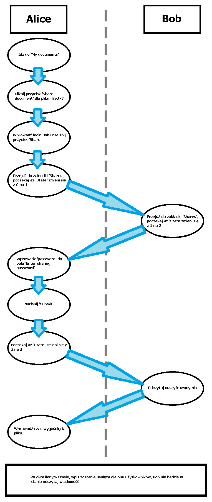
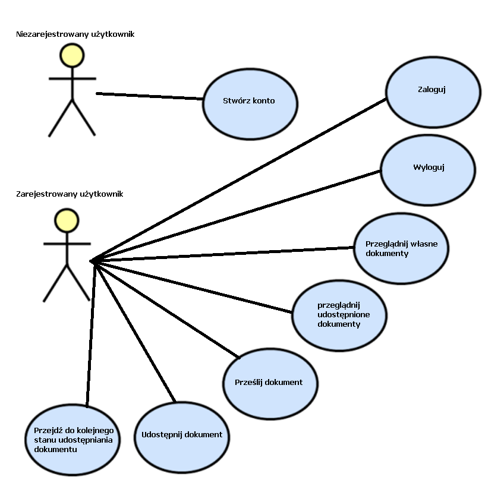

# Manual tests

## 1. Rejestracja

<table border="1">
<tbody>
<tr class="odd" style="font-weight: bold;text-align: center;">
<th>Przypadek</td>
<th>Wynik działania</td>
<th>Poprawność działania</td>
</tr>
<tr class="even">
<td>
Za krótki login (mniej niż 3 znaki)

Poprawna długość hasła (od 3 do 40 znaków)

Hasło to samo w obu polach
</td>
<td>Niepowodzenie, nie założono konta</td>
<td>Poprawnie</td>
</tr>
<tr class="odd">
<td>
Bardzo długi login (40 znaków)

Poprawna długość hasła (od 3 do 40 znaków)

Hasło to samo w obu polach
</td>
<td>Powodzenie – brak ograniczeń długości loginu</td>
<td>Poprawnie</td>
</tr>
<tr class="even">
<td>
Hasło nie zawierające znaków alfanumerycznych (alfabet arabski)

Poprawna długość hasła (od 3 do 40 znaków)

Hasło to samo w obu polach
</td>
<td>Niepowodzenie, nie założono konta</td>
<td>Poprawnie</td>
</tr>
<tr class="odd">
<td>
Poprawnej długości login

Za krótkie hasło (mniej niż 3 znaki)

Hasło to samo w obu polach
</td>
<td>Niepowodzenie, nie założono konta</td>
<td>Poprawnie</td>
</tr>
<tr class="even">
<td>
Poprawnej długości login

Za długie hasło (więcej niż 40 znaków)

Hasło to samo w obu polach
</td>
<td>Niepowodzenie, nie założono konta</td>
<td>Poprawnie</td>
</tr>
<tr class="odd">
<td>
Poprawnej długości login

Hasło poprawnej długości

Hasło zawierające znaki nie alfanumeryczne

Hasło to samo w obu polach
</td>
<td>Niepowodzenie, nie założono konta</td>
<td>Poprawnie</td>
</tr>
<tr class="even">
<td>
Poprawnej długości login

Hasło poprawnej długości

Różne hasło w polach 'Password' i 'Confirm password'
</td>
<td>Niepowodzenie, nie założono konta</td>
<td>Poprawnie</td>
</tr>
<tr class="odd">
<td>
Poprawnej długości login

Hasło poprawnej długości

Hasło to samo w obu polach
</td>
<td>Powodzenie – założono konto</td>
<td>Poprawnie</td>
</tr>
<tr class="even">
<td>
Poprawnej długości login

Użyty login zarejestrowanej osoby

Hasło poprawnej długości

Hasło to samo w obu polach
</td>
<td>Niepowodzenie, nie założono konta</td>
<td>Poprawnie</td>
</tr>
</tbody>
</table>

## 2. Logowanie

<table border="1">
<tbody>
<tr class="odd" style="font-weight: bold;text-align: center;">
<th>Przypadek</td>
<th>Wynik działania</td>
<th>Poprawność działania</td>
</tr>
<tr class="even">
<td>
Niepoprawny login

Niepoprawne hasło
</td>
<td>Niepowodzenie, nie uzyskano dostępu do systemu. 'Incorrect login or password'</td>
<td>Poprawnie</td>
</tr>
<tr class="odd">
<td>
Poprawny login

Niepoprawne hasło
</td>
<td>Niepowodzenie, nie uzyskano dostępu do systemu. 'Incorrect login or password'</td>
<td>Poprawnie</td>
</tr>
<tr class="even">
<td>
Niepoprawny login

Poprawne hasło
</td>
<td>Niepowodzenie, nie uzyskano dostępu do systemu. 'Incorrect login or password'</td>
<td>Poprawnie</td>
</tr>
<tr class="odd">
<td>
Poprawny login

Poprawne hasło
</td>
<td>Powodzenie, zalogowano do systemu</td>
<td>Poprawnie</td>
</tr>
</tbody>
</table>

## 3.  Testy panelu użytkownika

Poprzez szybkie przełączanie między zkładkami sprawdzałem stabilność
systemu, zakładka 'My documents' po pierwszym kliknięciu zaczeła się
ładować, przełączenie nie przerwało tego procesu i po powrocie do
zakładki uzyskałem poprawną informację "You did not upload any document
yet".

Wielokrotne wylogowywanie i logowanie do systemu nie zmniejszyło jego
stabilności.

## 4.  Załadowywanie dokumentów

<table border="1">
<tbody>
<tr class="odd" style="font-weight: bold;text-align: center;">
<th>Przypadek</td>
<th>Wynik działania</td>
<th>Poprawność działania</td>
</tr>
<tr class="even">
<td>Przenoszenie folderu do pola 'Drag &amp; Drop'</td>
<td>Niepowodzenie, nie przesłano pliku</td>
<td>Poprawnie</td>
</tr>
<tr class="odd">
<td>Przenoszenie pliku *.sql do pola 'Drag &amp; Drop'</td>
<td>Niepowodzenie, nie przesłano pliku</td>
<td>Poprawnie</td>
</tr>
<tr class="even">
<td>Przenoszenie pliku bez rozszerzenia do pola 'Drag &amp; Drop'</td>
<td>Niepowodzenie, nie przesłano pliku</td>
<td>Poprawnie</td>
</tr>
<tr class="odd">
<td>Przenoszenie pliku *.txt do pola 'Drag &amp; Drop'</td>
<td>Powodzenie, plik został przyjęty</td>
<td>Poprawnie</td>
</tr>
<tr class="even">
<td>
Plik *.txt jest obecny w polu drag and drop

Przenoszenie pliku *.txt do pola 'Drag &amp; Drop'
</td>
<td>Powodzenie, plik został zamieniony</td>
<td>Poprawnie</td>
</tr>
<tr class="odd">
<td>
Plik *.txt jest obecny w polu drag and drop

Hasło do pliku zostało wpisane
</td>
<td>Powodzenie, plik został przesłany na serwer, jest on dostępny w zakładce 'My documents'</td>
<td>Poprawnie</td>
</tr>
</tbody>
</table>

## 5.  Sharowanie dokumentu

<table border="1">
<tbody>
<tr class="odd" style="font-weight: bold;text-align: center;">
<th>Przypadek</td>
<th>Wynik działania</td>
<th>Poprawność działania</td>
</tr>
<tr class="even">
<td>
Co najmnije jeden dokument obecny

Kliknięcie Share document

Wylogowanie
</td>
<td>Brak zmiany stanu</td>
<td>Poprawnie</td>
</tr>
<tr class="odd">
<td>
Co najmnije jeden dokument obecny

Share document

Podanie za krótkiego loginu
</td>
<td>Niepowodzenie, błąd 'za krótki login'</td>
<td>Poprawnie</td>
</tr>
<tr class="even">
<td>
Co najmnije jeden dokument obecny

Share document

Podanie złego loginu
</td>
<td>Niepowodzenie, brak użytkownika</td>
<td>Poprawnie</td>
</tr>
<tr class="odd">
<td>
Co najmnije jeden dokument obecny

Share document

Podanie poprawnego loginu
</td>
<td>Powodzenie, plik został udzielony użytkownikowi, znajduje się on w 'Shares'</td>
<td>Poprawnie</td>
</tr>
</tbody>
</table>

W tym momencie zaczyna się semi automatyczny proces, użytkownik któremu
udostępniono plik musi się zalogować, aby kontunuować dzielenie pliku,
przejść do zakłady 'Shares' gdzie zostanie wysłany publiczny klucz do
użytkownika udestępniającego.

Użytkownik który udostępnia plik musi wprowadzić hasło którym został
zaszyfrowany oryginalny plik, ponieważ hasło jest dowolne, a serwer nie
ma informacji o zawartości pliku nie może zajsć żadna walidacja.

<table border="1">
<tbody>
<tr class="odd" style="font-weight: bold;text-align: center;">
<th>Przypadek</td>
<th>Wynik działania</td>
<th>Poprawność działania</td>
</tr>
<tr class="even">
<td>
Plik został udzielony

Podanie złego, nieoryginalnego hasła do pliku
</td>
<td>Brak zgodności hasła, odszyfrowany plik po stronie użytkownika któremu udostępniany jest plik jest niepoprawny</td>
<td>Poprawnie</td>
</tr>
<tr class="odd">
<td>
Plik został udzielony

Podanie poprawnego hasła do pliku
</td>
<td>Powodzenie, plik został poprawnie odszyfrowany po stronie drugiego użytkownika</td>
<td>Poprawnie</td>
</tr>
</tbody>
</table>

Następnie użytkownik udostępniający plik ustala czas po którym plik
wygasa. Wpis zostaje usunięty dla obu użytkowników. Użytkownik któremu
został udostępniony plik może wykorzystać ten czas, aby odczytać jego
zawartość plik pozostanie tam do czasu odświeżenia strony.

## 6. Przeprowadzone ataki
<table border="1">
  <tr class="odd" style="font-weight: bold;text-align: center;">
    <th>Przypadek</th>
    <th>Wynik działania</th>
    <th>Poprawność działania</th>
  </tr>
  <tr>
    <td>Losowy akceptowalny login Losowe akceptowalne hasło </td>
    <td>Po trzech próbach dostajemy jednogodzinny timeout </td>
    <td>Poprawne</td>
  </tr>
  <tr>
    <td> Prawidłowy login Złe hasło </td>
    <td>Po trzech próbach dostajemy jednogodzinny timeout</td>
    <td>Poprawne</td>
  </tr>
  <tr>
    <td> Zły login Prawidłowe hasło </td>
    <td>Po trzech próbach dostajemy jednogodzinny timeout</td>
    <td>Poprawne</td>
  </tr>
  <tr>
    <td> Atak słownikowy 1. administrator:administrator  2. user:user 3. root:root </td>
    <td>Po trzech próbach dostajemy jednogodzinny timeout</td>
    <td>Poprawne</td>
  </tr>
</table>

# Flow dzielenia dokumentu

## Założenia:

-   Dwóch użytkowników (Alice i Bob) zalogowanych na dwóch systemach.
-   Użytkownik Alice posiada jeden unikatowy dokument, parametry:

    -   Nazwa pliku: "file.txt"
    -   Zawartość pliku: "content"
    -   Hasło pliku: "password"
    -   Id pliku: 5c3e17a67683cb0018d55d79

# Diagram przypadków użycia

<table border="1">
<tbody>
<tr>
<th>Przypadek użycia</th>
<td>Stwórz konto</td>
</tr>
<tr>
<th>Opis</th>
<td>Rejestracja użytkownika w systemie do udostępniania plików</td>
</tr>
<tr>
<th>Warunki początkowe</th>
<td>Brak, nowy użytkownik</td>
</tr>
<tr>
<th>Aktor</th>
<td>Niezarejestrowany użytkownik</td>
</tr>
<tr>
<th>Procedura</th>
<td>
1.Przejdź do strony głównej

2.Kliknij "Register"

3.Wpisz login

4.Wpisz hasło

5.Powtórz hasło

6.Kliknij 'Submit'

</td>
</tr>
<tr>
<th>Warunki porażki</th>
<td>

Login nie spełnia wymagań

Hasło nie spełnia wymagać

Hasła nie zgadzają się w obu polach

</td>
</tr>
<tr>
<th>Warunki sukcesu</th>
<td>

Login spełnia wymagania

Hasło spełnia wymagania

Hasła zgadzają się w obu polach

</td>
</tr>
</tbody>
</table>

<table border="1">
<tbody>
<tr>
<th>Przypadek użycia</th>
<td>Zaloguj</td>
</tr>
<tr>
<th>Opis</th>
<td>Procedura zalogowania użytkownika do systemu</td>
</tr>
<tr>
<th>Warunki początkowe</th>
<td>Użytkownik musi powiadać konto</td>
</tr>
<tr>
<th>Aktor</th>
<td>Zarejestrowany użytkownik</td>
</tr>
<tr>
<th>Procedura</th>
<td>
1.Przejdź do strony głównej

2.Wpisz login

3.Wpisz hasło

4.Kliknij submit
</td>
</tr>
<tr>
<th>Warunki porażki</th>
<td>

Zły login

Złe hasło

</td>
</tr>
<tr>
<th>Warunki sukcesu</th>
<td>

Poprawny login

Poprawne hasło

</td>
</tr>
</tbody>
</table>

<table border="1">
<tbody>
<tr>
<th>Przypadek użycia</th>
<td>Wyloguj</td>
</tr>
<tr>
<th>Opis</th>
<td>Procedura wylogowania użytkownika z sytemu</td>
</tr>
<tr>
<th>Warunki początkowe</th>
<td>Użytkownik musi być zalogowany do systemu</td>
</tr>
<tr>
<th>Aktor</th>
<td>Zarejestrowany użytkownik</td>
</tr>
<tr>
<th>Procedura</th>
<td>
1.Przejdź do strony głównej

2.Kliknij 'Log Out'
</td>
</tr>
<tr>
<th>Warunki porażki</th>
<td>Brak</td>
</tr>
<tr>
<th>Warunki sukcesu</th>
<td>Brak</td>
</tr>
</tbody>
</table>

<table border="1">
<tbody>
<tr>
<th>Przypadek użycia</th>
<td>Przeglądnij własne dokumenty</td>
</tr>
<tr>
<th>Opis</th>
<td>Wyświetl wszystkie dokumenty które zostały przesłane do systemu</td>
</tr>
<tr>
<th>Warunki początkowe</th>
<td>Użytkownik musi być zalogowany do systemu</td>
</tr>
<tr>
<th>Aktor</th>
<td>Zarejestrowany użytkownik</td>
</tr>
<tr>
<th>Procedura</th>
<td>
1.Przejdź do strony głównej

2.Kliknij 'My Documents'
</td>
</tr>
<tr>
<th>Warunki porażki</th>
<td>Brak</td>
</tr>
<tr>
<th>Warunki sukcesu</th>
<td>Brak</td>
</tr>
</tbody>
</table>

<table border="1">
<tbody>
<tr>
<th>Przypadek użycia</th>
<td>Przeglądnij udostępnione dokumenty</td>
</tr>
<tr>
<th>Opis</th>
<td>Wyświetlenie wszystkich udostępnionych dokumentów prze danego użytkownika oraz wyświetlenie dokumentów które zostały udostępnione danemu użytkownikowi</td>
</tr>
<tr>
<th>Warunki początkowe</th>
<td>Użytkownik musi być zalogowany do systemu</td>
</tr>
<tr>
<th>Aktor</th>
<td>Zarejestrowany użytkownik</td>
</tr>
<tr>
<th>Procedura</th>
<td>
1.Przejdź do strony głównej

2.Kliknij 'Shares'
</td>
</tr>
<tr>
<th>Warunki porażki</th>
<td>Brak</td>
</tr>
<tr>
<th>Warunki sukcesu</th>
<td>Brak</td>
</tr>
</tbody>
</table>

<table border="1">
<tbody>
<tr>
<th>Przypadek użycia</th>
<td>Prześlij dokumenty</td>
</tr>
<tr>
<th>Opis</th>
<td>Wysłanie plików do systemu</td>
</tr>
<tr>
<th>Warunki początkowe</th>
<td>Użytkownik musi być zalogowany do systemu</td>
</tr>
<tr>
<th>Aktor</th>
<td>Zarejestrowany użytkownik</td>
</tr>
<tr>
<th>Procedura</th>
<td>
1.Przejdź do strony głównej

2.Kliknij 'DOCUMENTS SHARING APP'

3.Drag &amp; Drop plik do wysłania

4.Wpisz hasło do pliku

5.Kliknij "Save and continue"
</td>
</tr>
<tr>
<th>Warunki porażki</th>
<td>

Plik za duży

Złe rozszerzenie pliku

</td>
</tr>
<tr>
<th>Warunki sukcesu</th>
<td>

Plik odpowiedniej wielkości

Plik z rozszerzeniem *.txt

</td>
</tr>
</tbody>
</table>

<table border="1">
<tbody>
<tr>
<th>Przypadek użycia</th>
<td>Udostępnij dokument</td>
</tr>
<tr>
<th>Opis</th>
<td>Udostępnianie dokumentów które posiada dany użytkownik</td>
</tr>
<tr>
<th>Warunki początkowe</th>
<td>

Użytkownik musi być zalogowany do systemu

Użytkownik musi posiadać co najmniej jeden plik

</td>
</tr>
<tr>
<th>Aktor</th>
<td>Zarejestrowany użytkownik</td>
</tr>
<tr>
<th>Procedura</th>
<td>
1.Przejdź do strony głównej

2.Kliknij 'My documents'

3.Kliknij w przycisk "Share document" który należy do pliku który chcesz udostępnić

4.Wpisz login użytkownika któremu chcesz udostępnić plik

5.Kliknij "Share"
</td>
</tr>
<tr>
<th>Warunki porażki</th>
<td>Użytkownik o danym loginie nie istnieje</td>
</tr>
<tr>
<th>Warunki sukcesu</th>
<td>Użytkownik istnieje</td>
</tr>
</tbody>
</table>

<table border="1">
<tbody>
<tr>
<th>Przypadek użycia</th>
<td>Przejdź do kolejnego stanu udostępniania dokumentu</td>
</tr>
<tr>
<th>Opis</th>
<td>Proces pół-automatyczny który służy do bezpiecznego udostępniania dokumentu innym użytkowniką, poprzez obecność w zakładce "Shares" proces przechodzi do kolejnych stanów</td>
</tr>
<tr>
<th>Warunki początkowe</th>
<td>

Użytkownik musi być zalogowany do systemu

Użytkownik musi być w trakcie przyjmowania lub udzielania pliku

</td>
</tr>
<tr>
<th>Aktor</th>
<td>Zarejestrowany użytkownik</td>
</tr>
<tr>
<th>Procedura</th>
<td>
1.Przejdź do strony głównej

2.Kliknij 'Shares'

3.Poczekaj aż stan zostanie automatycznie zmieniony lub:

&nbsp;&nbsp;&nbsp;&nbsp;1.(State 2) Wprowadź hasło

&nbsp;&nbsp;&nbsp;&nbsp;2.(State 3) Wprowadź czas po którym plik przestanie być udostępniany
</td>
</tr>
<tr>
<th>Warunki porażki</th>
<td>

Timeout udostępniania

Podanie niepoprawnego hasła co spowoduje błędne odszyfrowanie pliku

</td>
</tr>
<tr>
<th>Warunki sukcesu</th>
<td>

Wykonanie procedury zanim udostępnianie zostanie unieważnione

Podanie prawidłowego hasła które posłużyło do zaszyfrowania pliku

</td>
</tr>
</tbody>
</table>
