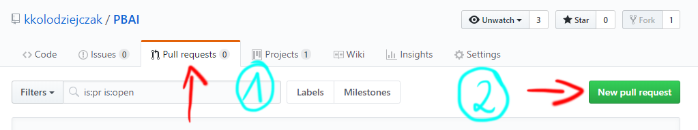
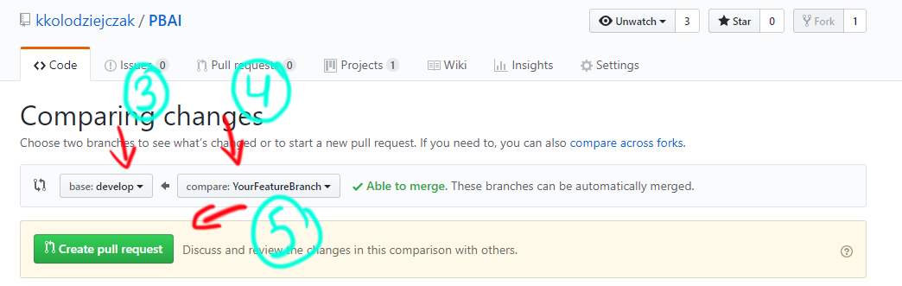

# PBAI

- [How To](#HowTo)
- [Team](#Team)
- [WorkFlow](#WorkFlow)
- [Help](#Help)

## HowTo
##### TODO: include instructions on how to execute everything and run tests etc.

## Team

| Github username    | Full Name             | Role |
|--------------|--------------|-------|
|kkolodziejczak | Krzysztof Kołodziejczak | Leader, DevOps|
|Arogancki | Artur Ziemba | Backend Developer |
|??? | Bartosz Gawdzis | Backend Developer |
| aliberski| Albert Liberski | Frontend Developer |
| ??? | Mateusz Gnyp | Tester |
|patryk191129 | Patryk Piotrowski | Documentation|
|??? | Patryk Prokurat | Documentation|
| jdyba | Jakub Dyba | Documentation |

## WorkFlow
Create branch from _develop_
```Bash
git checkout develop
git pull
git checkout -b "YourBranchNameWithoutSpaces"
```
do your stuff, after you are done create commit and push your changes to remote

### REMEMBER to include `#\d+` Task number in your commit message! 
```Bash
git add .
git commit -m "Comment that tells what You did in this commit #1"
git push origin "YourBranchNameWithoutSpaces"
```
And then create _Pull Request_ at github.com/kkolodziejczak/PBAI/pulls.

### Creation of Pull Request 
Click on Pull requests -> New pull request 

<p align="center">
  
</p>
Pick Develop branch as a target and Your's feature branch. Click Create Pull Request.
Fill up the form what changes You did and why You did them. Finalize creation of pull request.
<p align="center">
  
</p>

After that wait for approvement from other people and answer for any questions that they may have.

## Help
If You need help with something, contact `kkolodziejczak`.
