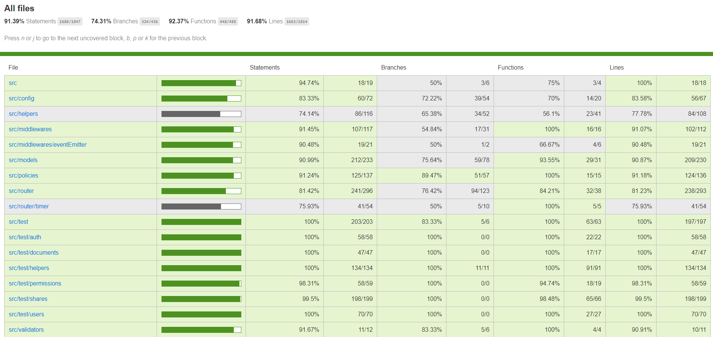

# Spis Treści
[1. Wymagania](#1-wymagania)  
[2. Jak odpalic](#2-jak-odpalic)  
[3. Testy](#3-testy)  
[3.1. Aktualny test coverage](#31-aktualny-test-coverage)  
[4. Zmienne srodowiskowe](#4-zmienne-srodowiskowe)  
[4.1. Ustawienie zmiennych](#41-ustawienie-zmiennych)  
[4.2. Zmienne wymagane](#42-zmienne-wymagane)  
[4.3. Zmienne opcjonalne](#43-zmienne-opcjonalne)  
[5. Routes](#5-routes)  
[5.1. Jak czytac readme](#51-jak-czytac-readme)  
[5.2. path](#52-path)   
[5.3. auth](#53-auth)  
[5.4. db](#54-db)  
[5.5. logs](#55-logs)  
[5.6. documents](#56-documents)    
[5.7. shares](#57-shares)  
[5.8. permissions](#58-permissions)   
[5.9. timer](#59-timer)  
[5.10. users](#510-users)  
[6. FAQ](#6-faq)  
[6.1. Jak utworzyc konto admina?](#61-jak-utworzyc-konto-admina)  
[6.2. Zmiana typu konta](#62-zmiana-typu-konta)  
[6.3. Jak ustawic certyfikat i klucz dla https](#63-jak-ustawic-certyfikat-i-klucz-dla-https)

# 1. Wymagania
Aby uruchamiac w dockerze potrzebny jest tylko zainstalowany docker oraz docker-compose.  
Aby uruchamiac lokalnie lub testowac nalezy miec zainstalowane srodowisko nodejs npm (min v8) oraz mongodb (min v4).

# 2. Jak odpalic
przestawic dockera na linuxowe containery i uruchomic  
```
docker-compose up
```
pierwszy raz trwa okolo 5 min potem juz pare sec (trzeba pobrac imagsy). Nastepnie zagladamy na \<http|https\>://localhost:\<port\>/

# 3. Testy
Pamietaj aby spelniac [wymagania](#1-wymagania).  
Przygotowanie  
```
npm i
cd app 
```
Uruchomienie autotestow
```
npm test
```
Sprawdzenie pokrycia testami
```
npm run coverage
```
Otrzymujemy wynik w konsoli oraz w przegladarce
## 3.1. Aktualny test coverage


# 4. Zmienne srodowiskowe
## 4.1. Ustawienie zmiennych
Aby zmienic wartosci uzyj pliku .env (dla zmiennych we wszystkich nazwyach srodowiska (NODE_ENV))
lub odpowiedno w pliku .env_\<nazwa-srodowiska\> np dla srodowiska "dev" lub "production" (zmiene te pokryja globalnie ustawione zmienne w pliku .env).
Nazwa zmiennej srodowsiska powinna byc globalnie ustawiona w twoim systemie (lub ide) pod nazwa NODE_ENV. (zalecane nazwy to "dev", "production", "test")

## 4.2. Zmienne wymagane
```json
"NODE_ENV",
"PORT",
"PORT_MONGO_ADMIN",
"MONGO_CONNECTION_STRING",
```

## 4.3. Zmienne opcjonalne
po dwukropku ich domyślne wartości
```json
"APP_PUBLIC": path.join(process.cwd(), `src`, `public`),
"LOG_LEVEL": 'trace', // no, info, debug, trace
"LOG_BODY": true,
"LOG_TEMPLATE": false /** */|| path.join(process.cwd(), 'src', 'assets', 'log-template.html')/**/,
"SESSION_SECRET": "OaMBtTO1UGw3ZCuPNdYU",
"COOKIE_MAX_AGE": 1000*60*60*24,
"GENERATED_ROUTES_FILE": path.join(process.cwd(), 'routes.txt'),
"TIMERS_DATABASE_NAME": "timers_collection",
"USERSS_DATABASE_NAME": "users_collection",
"PERMISSIONS_DATABASE_NAME": "permissions_collection",
"DOCUMENTS_DATABASE_NAME": "documents_collection",
"SHARES_DATABASE_NAME": "shares_collection",
"HTTPS": false,
"SSL_CERT_FILE": path.join(process.cwd(), `src`, `assets`, 'ssl-cert.pem'),
"SSL_KEY_FILE": path.join(process.cwd(), `src`, `assets`, 'ssl-key.pem'),
"NO_CACHE": true,
"LIMITER": true,
"CORS": true,
"STORE_SESSION_ON_MONGO": true,
"ADMIN_SECRET": "7jWIWmPkuPBR74yTmdNh",
"REJECT_BLACKLISTED_PASSWORDS": true,
"SERVE_LOGS": false /** */|| path.join(__dirname, '..', 'logs.html'),
"MAX_TIMER_SEC": 60*60*24*365, // one year
"DH_PRIME_LENGTH": 2048,
"CRYPTO_MOCKED": true,
"USERS_CAN_READ_LOGS": true,
"PRINT_CONFIG": true, // level debug 
"CREATE_ADMIN": true,
"AUTH_LIMITER": true,
"AUTH_LIMITER_RESET_PASSWORD": "sorry mr. server for bothering your awesomeness",
"EMAILS": true,
"EMAIL_SERVICE": "gmail",
"EMAIL_LOGIN": "pbai.audyt@gmail.com",
"EMAIL_PASSWORD": "YUQpRRj1OprtzGoVWAxU",
"SEND_EMAIL_ON_VALIDATION_ERROR": true,
"SEND_EMAIL_ON_POLICY_ERROR": true
```

# 5. Routes
Routes sa generowane do pliku routes.txt co uruchomienie. Mozecie je siegnac z dockera dzieki poleceniu dockera exec.

## 5.1. Jak czytac readme
Przykladowy opis route'a:  
## 5.2. path
### 5.2.1. /path/resource
* metoda
* dostep: listaWarunkow
* request payload
```
...obiekt
```
* opis 
* inne zwroty

Kazdy route moze zwrocic:
* 200 - wykonano pomyślnie
* 401 - brak wymaganej autoryzacji
* 404 - nie znaleziono lub brak dostępu
* 400 - nie właściwy payload lub jego wartości
* 500 - błąd serwera (dla srodowiska 'production' brak opisu bledu)

Admin moze wykonac kazdy request bez wzgledu na jego dostep. Pobiera on tez dokumenty oraz udostepnienia wszystkich uzytkownikow. Dostep noAccess znaczy ze moze tam wejsc tylko admin.

## 5.3. auth
### 5.3.1. /auth
1.
* put
* dostep: notAuthenticated
* body
```
login: schemes.login,
password: schemes.password,
password_confirmation: schemes.password_confirmation,
admin: schemes.isAdmin // tylko jesli chemy utworzyc admina, musi byc rowne zmiennej srodowiskowej ADMIN_SECRET
```
* tworzy nowe konto
* 409 (login zajety) 

2.
* post
* dostep: notAuthenticated
* body 
```
login: schemes.login,
password: schemes.password,
sorryLetter: hasToBeEqual AUTH_LIMITER_RESET_PASSWORD
```
* loguje usera. Jesli AUTH_LIMITER jest ustawione na true po 3 niepoprawnych probach logowania blokuje dostep do tej koncowki na 60 minut. Czas może zostać wyzerowany natychmiast jeśli zmienna AUTH_LIMITER_RESET_PASSWORD jest różna od false oraz pole "sorryLetter" zapytania bedzie równe zmiennej AUTH_LIMITER_RESET_PASSWORD.

3.
* delete
* dostep: authenticated
* wylogowuje usera

## 5.4. db
### 5.4.1. /db
1.
* get
* dostep: noAccess
* wysyla apke do zarzadzania baza danych

## 5.5. logs
### 5.5.1. /logs
1.
* get
* dostep: noAccess
* wysyla logi serwera w postaci pliku html, zmienna srodowiskowa USERS_CAN_READ_LOGS moze zapewnic serwowanie dla wszystkich

## 5.6. documents
### 5.6.1. /documents
1.
* put
* dostep: authenticated
* body
```
content: schemes.documentContent,
name: schemes.documentName
```
* dodaje nowy dokument dla uzytkownika. Content oznacza zakodowany juz dokument dokument w postaci base64
* response body
```
id: idUtworzonegoDokumentu
```

### 5.6.2. /documents/:id
1.
* get
* dostep: authenticated, documentOwner || documentIsSharedForUser
* query param
```
id: idDokumentu
```
* Przesyła dokument. Jesli uzytkownik jest wlascicielem w polu permissions otrzymuje id wszystkich dostepow do dokumentu. Jesli dokument jest mu tylko udostepniony widzi swoj permission oraz wlasciciela dokumentu.
* response body
```
id : idDokumentu,
permissions : [ 
    TablicaDostepow
],
content : ZaszyfrowanyDokumentBase64,
name : Nazwa
```

## 5.7. shares
### 5.7.1. /shares
1.
* put
* dostep: authenticated, documentOwner
* body
```
id: schemes.id,  // id dokumentu
login: schemes.login // login uzytkownika komu udostepnia dokument
```
* utworzenie obiektu udostepnienia dokumentu
* response body
```
id: idObiektu,
isOwner: true||false,
originUser: {
    id: idUsera
},
destinationUser: {
    id: IdUseraKtoremuUdostepniamy
},
state: statusUdostepnieina,
documentId: idDokumentuUdostpenionego,
prime: pWalgorytmieDH,
generator: gWalgorytmieDH
```
1. 
* get
* dostep: authenticated
* zwraca liste id obiektow share uzytkownika
* response body
```
"shares": [listaIdObiektowShare]
``` 

3.
* delete
* dostep: authenticated, shareOriginUser ||shareDestinationUser
* body
```
id: idShare
```
* Jesli otrzymano od shareOriginUsera usuwa obiekt udostepnienia, jesli shareDestinationUser share zostaje odrzucony (state ustawia sie na -1, udostepniajacy widzi wtedy ze partner go odrzucil)

### 5.7.2. /shares/:id
1.
* get
* dostep: authenticated, shareOriginUser ||shareDestinationUser
* query params
```
id: idShare
```
* pobiera obiekt share
* response body
```
id: idObiektu,
isOwner: true||false,
originUser: {
    id: idUsera,
    publicKey: publicznyKluczUdostepniajacego
},
destinationUser: {
    id: IdUseraKtoremuUdostepniamy,
    publicKey: publicznyKluczUzytkownikaKtoremuUdostepniamy
},
state: statusUdostepnieina,
documentId: idDokumentuUdostpenionego,
prime: pWalgorytmieDH,
generator: gWalgorytmieDH,
crypted: null
```

2.
* post
* dostep: authenticated, shareOriginUser || shareDestinationUser
* query params
```
id: idShare
```
* przekierowuje request pod odpowiedni post dla state share'a. Requesty zalezne od state moga byc ustawione tylko raz dla udostepnienia. Nie mozna zmeniac ustawionych im wartosci w pozniejszym procesie (ale mozna zaczac udaostepniac dokument od nowa). Uzytkownik moze udostepnic drugiemu okument pare razy - aby  miec do niego wiele hasel.
* 307 redirect

### 5.7.3. /shares/:id/0
1.
* post
* dostep: authenticated, shareOriginUser
* query params
```
id: idShare
```
* body
```
publicKey: publicKeyOriginUsera
```
* przyjmuje klucz Publiczny Dla Udostepnienia od uzytkownika ktory udostepnia dokument. Zmienia state na 1

### 5.7.4. /shares/:id/1
1.
* post
* dostep: authenticated, shareDestinationUser
* query params
```
id: idShare
```
* body
```
publicKey: publicKeyDestinationUsera
```
* przyjmuje klucz Publiczny Dla Udostepnienia od uzytkownika ktoremu udostepnia dokument. Zmienia state na 2

### 5.7.5. /shares/:id/2
1.
* post
* dostep: authenticated, shareOriginUser
* query params
```
id: idShare
```
* body
```
publicKey: publicKeyOriginUsera,
crypted: zakodowane haslo wspolnym sekretem
```
* sprawdza poprawnosc ponownie wyslanego klucza publiczegnego od uzytkownika udostepniajcego dokument. Jesli zgadza sie z poprzednio wyslanym ustaia crypted jako zakodowane haslo do dokumentu. Zmienia state na 3.

### 5.7.6. /shares/:id/3
1.
* post
* dostep: authenticated, shareDestinationUser
* query params
```
id: idShare
```
* body
```
publicKey: publicKeyDestinationUsera
```
* sprawdza poprawnosc klucza uzytkownika ktoremu udostepniamy dokument. jesli sie zgadza wysyla crypted oraz dostep do dokumentu. 
* response body
```
crypted: zahaslowanySekret,
permissionId: id,
originUser: {
    id: idUsera,
    publicKey: publicznyKluczUdostepniajacego
},
destinationUser: {
    id: IdUseraKtoremuUdostepniamy,
    publicKey: publicznyKluczUzytkownikaKtoremuUdostepniamy
}
```

## 5.8. permissions 
### 5.8.1. /permissions 
1.
* delete
* dostep: authenticated, hasOwnerPeemission
* body
```
id: idDostepu
```
* usuwa dostep po id oraz obiekt share jesli premission dotyczy udostepnienia. jesli dostep jest dostepem wlasciciela usunie on wszysktie dostepy do dokumentu.

2.
* get
* dostep: authenticated
* zwraca wszystkie dostepy dla uzytkownika
* response body
```
permissions: [tablicaIdDostepow]
```

### 5.8.2. /permissions/:id
1.
* get
* dostep: authenicated, dostep nalezy do uzytkownika lub wlasiciela dokumentu ktory go dotyczy
* query params
```
id: idDostepu
```
* zwraca obiekt dostepu dla usera
* response body
```
id : idDostepu,
timer : idTimera jesli istnieje,
userId : idUsera,
documentId : idDokumentu,
type : "o" || "r"
```

## 5.9. timer
### 5.9.1. /timer/permissions
1.
* put
* dostep: authenticated, hasOwnerPermission
* body
```
id: schemes.id, // id dostepu ktorego dotyczy timer
sec: schemes.sec // ilosc sekund za ile aktywowac
```
* ustawia timer ktory na aktywacji usunie dostep dla uzytkownika
* zwraca 409 jesli timer jest juz ustawiony dla tego dostepu
* response body
```
id: idUtworzonegoTimera
```

* delete
* dostep: authenticated, hasOwnerPermissionToDocumentOfTimer
* body
```
id: idTimer
```
* Usuwa timer

### 5.9.2. /timer/permissions/:id
1.
* get
* dostep: authenticated, wlasciciel dostepu ktorego totyczy timer lub dokumentu ktorego tytyczy dostep timera
* query params
```
id: idTimera
```
* zwraca obket timera
* response body
```
type: "deletePermission"
params: {
    sec: IloscCzasuNaKtoraTimerZostalUstawiony,
    userId: idWlascicielaDokumentu
}
when: timeStamp kiedy sie aktywuje
object: idDostepu,
objectModelName: nazwaKolekcjiDostepow 
```
## 5.10. users
### 5.10.1. /users
1.
* get
* dostep: authenticated
* zwraca informacje o uzytkowniku
* response body
```
login: user.login,
isAdmin: user.isAdmin,
permissions: [user.permissions],
shares: [user.shares]
```
2.
* post
* dostep: authenticated, jesliZminiaCzyjesDaneMusiBycAdminem
* body
```
login: schemes.loginNotRequired, // tylko dla admina aby zminic kogos dane
newLogin: schemes.loginNotRequired,
newPassword: schemes.passwordNotRequired
```
* zmieia dane uzytkownika login/lub wlasne - mozna zmienic login lub/i haslo
* zwraca 409 jesli nowy login jest zajetyw
3.
* delete
* dostep: noAccess
* body
```
login: loginUsera
```
* usuwa uzytkownika
  
### 5.10.1. /users/:id
1.
* get
* dostep: authenticated
* zwraca login uzytkownika o podanym id
* response body
```
login: 'loginOfUserOfProvidedId'
```

# 6. FAQ
## 6.1. Jak utworzyc konto admina?
Do payloadu rejestracji dodac pole "admin" o wartosci rownej zawartosci zmiennej srodowiskowej ADMIN_SECRET

## 6.2. Zmiana typu konta
Nie ma obecnie takiej mozliwosci

## 6.3. Jak ustawic certyfikat i klucz dla https
Generacja kluczy:
```
openssl genrsa -out ssl-key.pem 1024
openssl req -new -key ssl-key.pem -out certrequest.csr
openssl x509 -req -in certrequest.csr -signkey ssl-key.pem -out ssl-cert.pem
```
Ustawic odpowiednie sciezki w configu